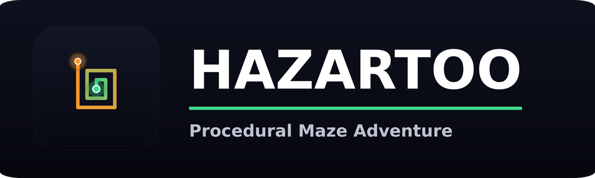

<p align="center">
  
</p>

<h1 align="center">هزارتو (Hazartoo)</h1>

<p align="center">یک بازی ماز تصادفی و رو به رشد، ساخته‌شده با پایتون و Pygame</p>

> دانشگاه خوارزمی کرج — پروژه‌ی درس برنامه‌نویسی پیشرفته (AP)
> استاد: خانم مهندس زهرا علیزاده
> نویسندگان: روح‌اله حسینی، شایان رضاپور

---

## درباره‌ی بازی

**هزارتو** یک بازی ماز دو‌بعدی است که در هر مرحله یک ماز کاملاً تصادفی و جدید با الگوریتم DFS ساخته می‌شود. هرچه جلوتر می‌روید (تا ۱۰ مرحله)، ماز بزرگ‌تر و راهروها باریک‌تر و سخت‌تر می‌شوند.

این نسخه، بازنویسی کامل نسخه‌ی اولیه‌ی پروژه‌ی کلاسی است؛ تمرکز اصلی روی «حس حرکت» بازیکن و پایداری کامل بازی بوده. جزئیات را در بخش [چه چیزهایی بهتر شده](#-چه-چیزهایی-بهتر-شده) بخوانید.

---

## ✨ ویژگی‌ها

- **حرکت نرم و پیوسته با نگه‌داشتن کلید** — کافی‌ست یک جهت را نگه دارید؛ بازیکن با سرعت ثابت و پیوسته در راهروها حرکت می‌کند، دقیقاً مثل بازی‌های کلاسیک آرکید. با رها کردن کلید بلافاصله می‌ایستد و می‌توانید وسط پیچ‌ها هم جهت را عوض کنید بدون این‌که حرکت قطع شود.
- **ماز تصادفی و همیشه قابل‌حل** — هر مرحله یک ماز کاملاً جدید، و نقطه‌ی پایان همیشه از نقطه‌ی شروع قابل دسترسی است (با جست‌وجوی BFS، دورترین نقطه‌ی واقعاً قابل‌رسیدن به‌عنوان پایان انتخاب می‌شود).
- **افزایش تدریجی سختی** — راهروها هر مرحله باریک‌تر می‌شوند، اما با یک حد پایین منطقی که ماز هیچ‌وقت غیرقابل‌بازی نشود.
- **پایداری در هر اندازه‌ای** — تولید ماز به‌طور کامل بازنویسی شده تا از بازگشت (recursion) استفاده نکند و ریسک کرش در مازهای بزرگ از بین برود.
- **توقف موقت، شروع دوباره، قطع موزیک** — منوی شروع، صفحه‌ی پایان مرحله، تایمر هر مرحله و کل بازی، و صفحه‌ی پایان بازی.
- **مقاوم در برابر فایل‌های گمشده** — نبود فایل آیکون یا موزیک هرگز باعث کرش بازی نمی‌شود.

---

## 🎮 راهنمای بازی

| عنصر | معنی |
|---|---|
| 🔵 مربع آبی | نقطه‌ی شروع |
| 🟠 دایره‌ی نارنجی ضربان‌دار | نقطه‌ی پایان / هدف |
| 🟢 دایره‌ی سبز | بازیکن (شما) |

از نقطه‌ی آبی به نقطه‌ی نارنجی برسید تا به مرحله‌ی بعد بروید. با رسیدن به مرحله‌ی ۱۰، بازی را کامل می‌کنید.

### کلیدها

| کلید | عملکرد |
|---|---|
| `↑ ↓ ← →` یا `W A S D` | حرکت — **نگه دارید تا حرکت ادامه پیدا کند**، رها کنید تا بایستد |
| `P` یا `ESC` | توقف موقت / ادامه |
| `R` | شروع دوباره‌ی مرحله‌ی فعلی |
| `M` | قطع / وصل موزیک |
| `SPACE` / `ENTER` | شروع بازی (در منو) / بازی دوباره (بعد از پایان بازی) |
| `ESC` (در منو) | خروج از بازی |

---

## 🚀 نصب و اجرا

### پیش‌نیاز
پایتون ۳.۸ به بالا

### مراحل
```bash
# ۱. پروژه را اکسترکت یا کلون کنید
cd hazartoo

# ۲. نصب پکیج‌های مورد نیاز
pip install -r requirements.txt

# ۳. اجرای بازی
python3 app.py
```

---

## 🛠 چه چیزهایی بهتر شده

1. **حرکت پیوسته با نگه‌داشتن کلید (درخواست اصلی)**: قبلاً با هر بار فشردن کلید فقط یک خانه حرکت می‌کرد. حالا با نگه‌داشتن کلید، بازیکن پیوسته و نرم حرکت می‌کند تا وقتی کلید را رها کنید؛ حرکت مستقل از فریم‌ریت است (بر اساس delta-time) و پیچیدن دور گوشه‌ها هم روان است.
2. **تولید ماز بدون بازگشت (recursion)**: تابع قبلی ماز را با یک تابع بازگشتی می‌ساخت. در مراحل بالا که ماز چند هزار خانه دارد، این روش می‌توانست از سقف عمق بازگشت پیش‌فرض پایتون (۱۰۰۰) عبور کند و بازی را با خطا متوقف کند. این تابع الان با یک پشته (stack) دستی و بدون بازگشت نوشته شده و برای هر اندازه‌ای از ماز پایدار است.
3. **تضمین قابل‌حل بودن ماز**: نقطه‌ی پایان حالا با الگوریتم BFS به‌عنوان دورترین خانه‌ی *واقعاً قابل‌دسترس* از نقطه‌ی شروع انتخاب می‌شود. در نسخه‌ی قبلی نقطه‌ی پایان همیشه گوشه‌ی پایین-راست بود که از نظر فنی امکان داشت روی دیوار بیفتد.
4. **بهبود عملکرد**: ماز هر مرحله فقط یک‌بار روی یک surface جدا رسم می‌شود و هر فریم فقط blit می‌شود، به‌جای رسم دوباره‌ی تک‌تک خانه‌ها در هر یک از ۶۰ فریم بر ثانیه.
5. **حس بازی کامل‌تر**: منوی شروع، توقف موقت، شروع دوباره، قطع موزیک، تایمر مرحله و کل بازی، انیمیشن پایان مرحله، و صفحه‌ی پایان بازی با زمان نهایی.
6. **هویت بصری جدید**: اسم، آیکون و پالت رنگی جدید (پایین توضیح داده شده).
7. **بارگذاری امن‌تر فایل‌ها**: خطای بارگذاری آیکون یا موزیک جدا مدیریت می‌شود و هرگز باعث کرش بازی یا خراب ماندن سیستم صدا نمی‌شود.

---

## 🎨 اسم و لوگو

اسم بازی به **Hazartoo (هزارتو)** تغییر کرد — کلمه‌ی فارسیِ رایج برای «ماز/لابیرنت». لوگوی جدید یک مارپیچِ چهارگوش استایل‌شده است که از نقطه‌ی شروع (سبز) تا نقطه‌ی پایان (نارنجی) کشیده شده، هماهنگ با رنگ‌های داخل بازی.

---

## 📁 ساختار پروژه

```
hazartoo/
├── app.py              # کد اصلی بازی
├── requirements.txt
├── LICENSE
├── img/
│   ├── icon.png         # آیکون پنجره (۲۵۶×۲۵۶)
│   ├── icon_512.png      # آیکون با کیفیت بالا
│   └── banner.png        # بنر readme
└── music/
    └── game_music.mp3
```

---

## 📜 لایسنس

فایل [LICENSE](LICENSE) را ببینید.
